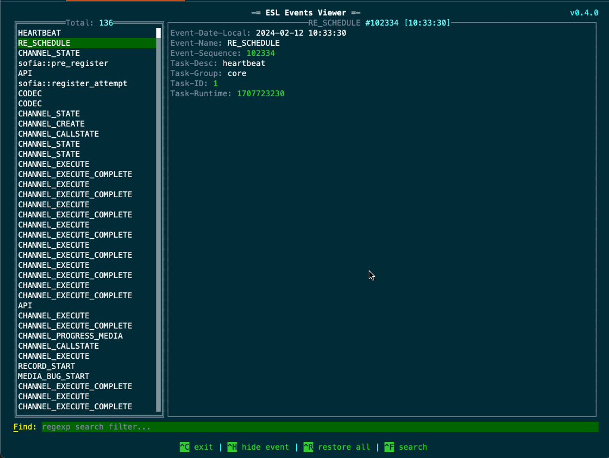

# FreeSWITCH Events Log Viewer

Приложение для просмотра и поиска по логам событий FreeSWITCH, сохранённых в формате JSON stream.



При запуске приложение пытается прочитать лог с событиями из файла `events.log`. Можно указать путь 
к другому файлу с логами с помощью параметра `-file <имя файла>`.

По умолчанию отображение следующих заголовков скрыто:

- `Core-UUID`
- `Event-Calling-File`
- `Event-Calling-Function`
- `Event-Calling-Line-Number`
- `Event-Date-GMT`
- `Event-Date-Timestamp`
- `FreeSWITCH-Hostname`
- `FreeSWITCH-IPv4`
- `FreeSWITCH-IPv6`
- `FreeSWITCH-Switchname`
- `FreeSWITCH-Version`

Если необходимо их видеть, то нужно указать при запуске параметр `-all`.

Так же в параметрах запуска можно сразу указать строку для поиска, чтобы отображались только те 
события, в которых эта строка найдена (_поиск ведется с учётом регистра_):

```shell
$ ./fs_event_log -all -file out.log sofia/B2BUA/4986517174963
```

Для сбора логов можно воспользоваться приложением 
[`fs_event_log`](https://github.com/mdigger/esl/tree/main/cmd/fs_event_log):

```shell
$ go install github.com/mdigger/esl/cmd/fs_event_log@latest
$ fs_event_log -addr 127.0.0.1 -password ClueCon > events.log
```

